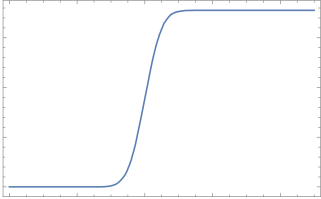
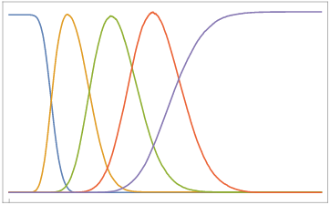

# NUSH-IChTo-problem5

Computational simulation of my solution to problem 5 of NUSH IChTo selections, "Willy Wonka's New Candy".

## Overview

There are 5 tastes, each stored in a microcapsule. There are 4 different microcapsule, each with the same internal radius, but different wall thickness.

For the first 4 tastes, there are an additional 4 more compounds ("removers"), as described in my presentation. Removers remove the flavour compound from the solution.

## How does it work?

The program simulates the breakdown of the microcapsule starch wall by enzyme amylase and records the volume of substance in the microcapsule that has been released at each time step.
                   
### Notes

- **Pseudo-zero order** reaction is assumed.

- The kinetic constant of amylase does not matter, as only one reaction is taking place. 

- Each **time step is relative**. Radius and thickness are measured in micrometers, however this is not necessary, as volume can also be relative.

- The radius is defined as the distance from the center of the microcapsule to the edge of the shell, and not the center of the shell (in other words, the radius includes the wall thickness).

- The reactions to remove all the flavours are **instantaneous** and **goes to completion**.

### 1) Normal Distribution

First, the program generates a list of numbers representing the radius and thickness of each microcapsule. 

This is done using a normal distribution. The values of the mean and standard deviation were obtained from literature, and interpolated for values that did not exist.

### 2) Enzyme activity

At each timestep, the volume of the microcapsule shell is calculated and a certain volume of the shell is removed. Since the reaction is pseudo-zero order, the same amount of volume is removed from the shells at each time step.

Next, the resulting radius and thickness is calculated.

### 3) Output

When the volume of the shell is calculated to be below 0, the microcapsule is assumed to have burst, and the volume inside the microcapsule is added to a list of the total volume released at each step. 

The volume of the remover is subtracted from the total volume released at each step.

At the end of the simulation, the program writes all this data to a file.

## Code

The code was written in C++ 14 and compiled using [GCC](https://gcc.gnu.org/) 6.3.0

I initially wrote the code in python but the program got too slow when I added more microcapsules so I switched to C++.

### Normal Distribution

The normal distribution was created using `std::normal_distribution`.

Use `std::normal_distribution` by including `<random>`.

### Classes

There are 2 classes, `Microcapsule` and `Substance`.

`Microcapsule` contains the `radius`, `thickness`, `initialRadius`, `initialThickness` and `burst`. `burst` specifies if the microcapsule has already burst.

`Substance` contains `radius`, `rSigma`, `thickness`, `tSigma`, `num`, `microcapsules` and `volReleased`. `rSigma` and `tSigma` specify the standard deviation of `radius` and `thickness` respectively. `num` specifies the number of microcapsules. `microcapsules` is a vector of `Microcapsule` objects. `volReleased` is a vector of the volume released at each time step.

### Main Program

At each time step, the program loops through each substance, and then loops through each microcapsule in the substance. If the `microcapsule.burst` is `true`, the program skips to the next microcapsule.

## Visualisation

Data obtained was plotted and visualised using [Mathematica](https://www.wolfram.com/mathematica/). 

### Graphs

This graph shows the volume of one substance released against the relative time.

This graph shows the volume of 5 substance released against the relative time.

